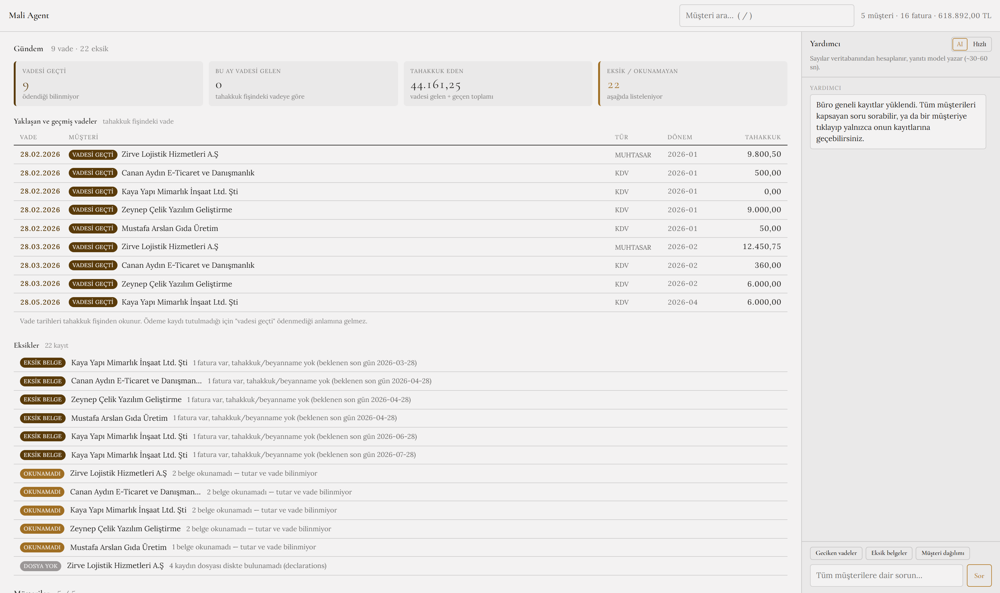
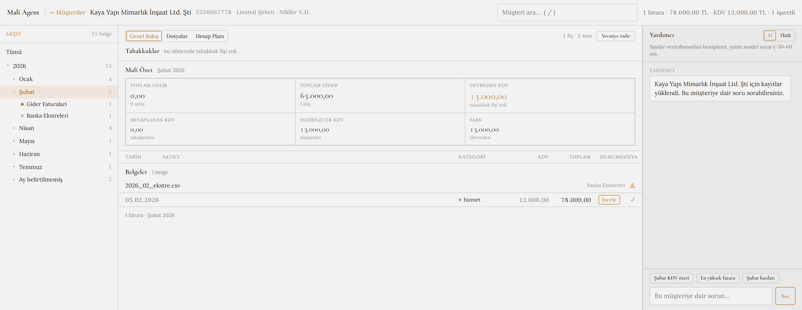

# Mali Agent

A local document workspace for a Turkish accounting practice. It reads the archive you
already keep on disk — client folders of e-Arşiv invoices, tahakkuk fişleri, beyannameler
and bank statements — extracts what is in them, tells you what needs attention today, and
hands your ledger software a yevmiye fişi.

It is a companion to Luca/Zirve/Mikro, not a replacement. Those are where you post entries
and file declarations. This is where you find the paperwork, see what is due, and produce
the file you import into them.

**Nothing leaves the machine.** Inference runs through
[Foundry Local](https://learn.microsoft.com/azure/ai-foundry/foundry-local/); the web
server and the model server both bind `127.0.0.1`. The front end is served entirely from
disk too — React and the two web fonts are vendored rather than pulled from a CDN — so the
dashboard opens with the network unplugged. There are no calls to any model provider, and
no telemetry.

> **Status: a personal project, not a product.** It has been checkpointed against a
> handful of real documents and a lot of synthetic ones. Read
> [Known limitations](#known-limitations) before pointing it at a real practice.

---



---

## Quick start

Requires Python 3.11+ and [Foundry Local](https://learn.microsoft.com/azure/ai-foundry/foundry-local/)
on Windows.

```powershell
python -m venv .venv
.\.venv\Scripts\python.exe -m pip install -r requirements.txt
foundry model download qwen3-4b
foundry model download qwen3-embedding-0.6b
```

Then either:

```powershell
.\.venv\Scripts\python.exe main.py --serve
```

and open <http://127.0.0.1:8000>, or double-click **`Mali Agent.cmd`**, which starts
Foundry Local, starts the dashboard and opens the browser for you.

Load some data — either your own archive (layout below) or the bundled demo:

```powershell
.\.venv\Scripts\python.exe scripts\seed_mock_archive.py
```

`scripts\check_env.py` verifies the environment at any time.

<details>
<summary>Building a standalone .exe</summary>

```powershell
.\.venv\Scripts\pyinstaller.exe MaliAgent.spec --noconfirm
```

Produces `dist\MaliAgent\MaliAgent.exe`. A folder build rather than one-file, because a
single exe would unpack ~215 MB of pandas and scikit-learn on every launch. The database
is written **beside the .exe**, not into PyInstaller's temp directory, so data survives
closing the program.
</details>

---

## The archive is the data model

Client, year, month and document type all come from the folder path, so nothing has to be
guessed from document contents:

```
C:\clients\
  45678912345 - Canan Aydın E-Ticaret\      ← VKN/TCKN - Ünvan
    2026\
      01_Ocak\
        1_Gelir_Faturalari\    *.pdf        → sales invoices
        2_Gider_Faturalari\    *.pdf        → purchase invoices
        3_Beyannameler\        *.pdf        → filed declarations
        4_Tahakkuklar\         *.pdf        → accrual receipts
        5_Banka_Ekstreleri\    *.csv/xlsx   → bank statements
      belgeler\                *.pdf        → licences, contracts (no month)
```

```powershell
.\.venv\Scripts\python.exe main.py --ingest-archive "C:\clients"
```

Three things about this are deliberate:

- **The client folder carries the tax number**, and ingest parses it. That is what makes
  the sales/purchase split work without anyone typing a VKN into the UI — and it means the
  tax id is the client's identity, so renaming a folder to fix an ünvan follows the client
  instead of forking it into a second row.
- **`1_Gelir` vs `2_Gider` states the invoice direction**, which beats comparing tax ids:
  whoever filed the document knew which side of the ledger it belonged on.
- **The month level is optional.** A document filed straight under the year keeps
  `month = NULL` and shows as "Ay belirtilmemiş". It is never back-filled from the
  document's own date — the field records where a file *sits*, so inventing it would hide
  exactly the misfiling you want to catch.

Ingest is idempotent, follows files that move between folders, and prunes rows whose file
has left the archive (scoped to the root just walked, so `--client` cannot delete anyone
else's data).

---

## What it does

### Gündem — the landing page

Opens on what needs attention, not on a client list: filing deadlines bucketed
*gecikmiş / bu hafta / bu ay*, periods that have invoices but no tahakkuk past their filing
date, and declarations held but unreadable. Clicking any row opens that client at that
exact month.

Two rules shape this, both about not overstating:

**The receipt's own vade is authoritative.** GİB moves deadlines — May 2026's KDV and
muhtasar were both pushed to 3 June — so a statutory calendar is only ever used to decide
whether a *missing* declaration is late, and is labelled an expectation.

**A passed due date is not an unpaid bill.** Nothing here records payment: a tahakkuk
states what was assessed, not whether it was settled. So the wording is "vadesi geçti", the
total is "tahakkuk eden", and the board says so in as many words.

### The client workspace

- **Arşiv tree** — Year → Month → Category, mirroring the folders. Selecting any node
  narrows the summary, the tables and the export together.
- **Mali Özet** — Toplam Gelir/Gider, Hesaplanan and İndirilecek KDV, and
  Ödenecek-or-Devreden, cross-checked against what the tahakkuk fişi actually assessed,
  with the disagreement stated rather than reconciled away.
- **Tahakkuklar** and the invoice ledger, each row with a file-present indicator and a
  full-screen PDF preview.
- **Hesap Planı** — supplier rules and category defaults.
- **Yevmiye indir** — the journal export, scoped to whatever the tree has selected.



### Search

In the header, always visible. Matches client name and VKN/TCKN; `/` focuses it, Esc
clears. Typing from inside a client returns to the list, because looking for a client while
in a different one is the normal case.

---

## The ledger bridge

Invoices become the standard Tekdüzen double entry:

```
Satış (gelir faturası)             Alış (gider faturası)
  120 Alıcılar          B tutar      770 Genel Yönetim Gid.  B matrah
    600 Yurt İçi Satış  A matrah     191 İndirilecek KDV     B kdv
    391 Hesaplanan KDV  A kdv          320 Satıcılar         A tutar
```

Exported as semicolon-separated CSV with Turkish amounts and a UTF-8 BOM, so Excel and the
ledger importers read `İndirilecek KDV` instead of mangling it.

**An entry that does not balance is never emitted.** A ledger import out by a kuruş posts
cleanly, looks right, and surfaces weeks later as a trial balance that will not close.
Anything that fails is listed by invoice number, and the workspace shows
"N fatura aktarılamıyor" beside the download — so refusals are seen *before* the file is
taken.

### Where an expense posts

Most specific first:

1. **A supplier rule** — "this counterparty always posts here". Keyed on the seller's VKN
   rather than their name, because the same issuer arrives as
   `TURKCELL İLETİŞİM HİZMETLERİ A.Ş.` on one invoice and `Turkcell` on the next. The Hesap
   Planı tab suggests suppliers seen twice or more with no rule yet.
2. **A category override** — 153 vs 760 vs 740 depends on the business, not the invoice
   text, so it is stated rather than inferred.
3. **Capitalisation.** VUK md. 313: a fixed asset over **12.000 TL** (KDV hariç, 2026)
   cannot be written off in one year — it goes to 255 Demirbaşlar. This one is a rule, not a
   preference, so it applies automatically and says that it did.
4. **Otherwise 770 Genel Yönetim Giderleri.**

Where you have stated an account and the amount crosses the capitalisation limit anyway,
your instruction stands and a note is raised instead. You are the professional — but a
stale rule quietly expensing a 40.000 TL machine is what an inspection finds.

---

## The assistant

`agent.py` splits the work so the model never touches arithmetic:

1. `router.py` answers from SQL — exact, instant, already tested.
2. Those computed facts are handed to the model as ground truth, and it is asked only to
   phrase them.

**The model controls the wording; the database controls the numbers.** The computed line is
shown beneath every answer, so phrasing can always be checked against what SQL returned.
The split exists because it was measured: asked to answer "en son ne zaman alışveriş
yaptım" from embeddings alone, `qwen3-4b` replied with a date that appears nowhere in the
corpus.

| Mode | Behaviour | CPU | GPU |
|---|---|---|---|
| **AI** | SQL computes, model phrases, conversation carries | 25–35s a sentence, 150–220s a nine-row table | seconds |
| **Hızlı** | Raw computed answer, no model call | instant | instant |

The CPU figures are prompt processing, not thinking: "Kaç belge kayıtlı?" spent **41
seconds producing thirteen tokens**. A nine-row table makes the model emit ~557 tokens
instead, which is the whole of the difference. A smaller model does not help — measured,
qwen3-1.7b came back *slower* on median and kept one figure in four where qwen3-4b kept
four.

A GPU does. Where Foundry Local has no driver for the card in the machine, the client
points anywhere OpenAI-compatible instead, so a supported GPU is usable through Ollama
or vLLM:

```bash
export FOUNDRY_LOCAL_ENDPOINT=http://127.0.0.1:11434/v1   # e.g. Ollama
```

`CHAT_ALIAS` and `EMBED_ALIAS` in `foundry.py` then have to match the model ids that
server reports.

It answers from the compliance data as well as the invoice tables — "hangi müşterinin
vadesi geçti", "hangi müşteride eksik belge var", "müşteri bazında dağılım" all read the
same `compliance.py` the Gündem board does, so the two cannot disagree.

Things learned by measurement and encoded here:

- **Nothing the model writes is shown unchecked.** Asked which clients were overdue,
  qwen3-4b once listed a KDV filing for a client who had none in that period, while
  dropping a real 12.450,75 TL one — inventing a tax liability and hiding another in a
  single answer. Checking amounts does not catch that: the client, the figure and the
  period were all real, and only the *combination* was invented. So rows are checked as
  rows — a line carrying money has to agree with one line of the computed facts on the
  amount, on a word saying whose row it is, and on the period. A reply that fails is
  redrawn once, then dropped in favour of the computed answer.
- **Scope travels with every figure.** Asked "Canan Aydın'ın kaç faturası var" on the
  practice-wide page, an earlier version computed the *global* count and the model
  presented it as Canan's — a real number under the wrong name. Computed answers now carry
  their subject, and asking about another client from a client's page is refused rather
  than answered with the wrong books.
- **Refusals are never reworded by the model.** Handed "this panel covers Zeynep, ask on
  Canan's page", qwen3-4b returned "bu bilgi faturalarda yok" — a different and false claim.
- **Anything the model reliably drops is restored in code, not asked for again.** Four
  prompt instructions were measured as ignored, the clearest being the table's header
  total: missing in four runs out of five, leaving a vendor list the reader has to add up
  by hand. It is put back from the computed answer, so its digits still come from SQL.
- **It is written for the müşavir, not the taxpayer.** The suggestion list used to offer
  "En son ne zaman alışveriş yaptım?" and the greeting said "N faturanız yüklü" — wording
  inherited from when this tracked one person's own spending. An accountant does not go
  shopping in a client's ledger. A test now fails on first-person phrasing, and the
  suggestions differ by scope, because "dönem hasılatı" means nothing summed across
  unrelated businesses.

`scripts/eval_agent.py` asks 23 questions whose answers SQL already knows, checking route,
facts and answer separately — so a routing bug is distinguishable from the model mangling a
correct number. `--fast` checks the computed layer and passes 23/23; without it the same
questions go through the model as well, which takes far longer to run.

---

## Architecture

```
PDF ─► pdf_text.py ─► extractors/ ─► category.py ─► db.py ─► SQLite
       (text +        (label-anchored  (embeddings + (dedupe on
        REDACTION)     regex profiles)   trained head) no + VKN + client)
                                                          │
        ┌─────────────────────────────────────────────────┤
        │                                                 │
   compliance.py        hesap.py            router.py ────┴──── stats.py
   (deadlines,          (Tekdüzen           (intent + slots)    (aggregates)
    document gaps)       journal, export)         │
                                            agent.py ─► foundry.py ─► Foundry Local
                                            (grounding)             (qwen3-4b)
```

Redaction happens at the parser boundary, before text reaches the database, the embeddings
or any model. Removed: buyer TCKN, addresses, IBANs, emails, phone numbers. Kept: the
seller's VKN, which is needed to group spend by legal entity. Asking a model to "please
ignore the national ID" is a request; removing the bytes first is a guarantee.

Categories are assigned by a logistic-regression head trained on frozen
`qwen3-embedding-0.6b` vectors — 95.2% on 5-fold cross-validation over ~1800 labelled
strings. The encoder is never fine-tuned, which is why training runs on CPU in seconds.
Measured alternatives it replaced, on 6 held-out vendors: `qwen3-4b` generative 1/6,
`qwen3-8b` generative 2/6, embedding zero-shot 3/6.

---

## Tests

```powershell
.\.venv\Scripts\python.exe -m pytest                    # everything
.\.venv\Scripts\python.exe -m pytest tests/test_ui.py   # browser only
.\.venv\Scripts\python.exe scripts\eval_agent.py        # assistant, needs Foundry
```

**604 tests, 90% line coverage** over `malimusavir/`.

30 of them drive the dashboard in a real browser (Playwright — after installing, run
`python -m playwright install chromium`). Those exist because every UI regression this
project has had was invisible to the Python suite: a preview pane that rendered at
208×157px inside the tree rail, a tab panel nested where its condition could never be true,
a search box 929px down a 720px viewport, an `<iframe src="{{ preview.url }}">` that made
the browser fetch the literal template and 404 on every load. All of them parsed cleanly.
What they broke was geometry, reachability and network behaviour — so that is what the
browser tests assert, including that no request leaves `127.0.0.1` and that the page still
renders with all off-machine traffic blocked.

---

## Known limitations

Worth reading before trusting it with a real practice.

- **Beyannameler are stored, not parsed.** Only the tahakkuk fişi has an extractor. A
  beyanname is listed and openable, flagged `beyanname:not_parsed`, and no figure is claimed
  from it. Fixing this needs a real KDV1/MUHSGK output to check against.
- **Bank statements are stored, not read.** Reconciliation — matching payments against
  invoices — is the obvious next feature and does not exist.
- **Categories are not a chart of accounts.** `market`, `yeme-içme` and friends are
  inherited from an earlier single-user design. They feed the hesap kodu defaults, but a
  practice posting in earnest should set supplier rules instead.
- **Extraction is checkpointed against a handful of real documents.** Every real document
  seen so far has found a bug that synthetic ones could not — a TCKN the redactor preserved,
  a receipt serial read as a VKN, a buyer read as the seller. Assume more are waiting.
- **The model still drops supporting detail on single-figure answers.** qwen3-4b is a 4B
  model rephrasing dense Turkish tables. Asked "toplam tutar ne kadar" it answers
  "618.892,00 TL" and drops the date range; it occasionally mangles a word ("fattır"
  for "faturadır"). Measured over all 20 advertised questions, 14 come back with every
  figure intact and all 20 answer the question correctly. Table answers are the ones
  that matter most and are now clean. The computed answer is printed under every reply
  for exactly this reason, and Hızlı mode skips the model entirely.
- **OCR is out of scope.** A scanned PDF with no text layer is flagged
  `scanned:no_extractable_text`, not guessed at.
- **No GİB or e-Fatura integration**, deliberately: it would need credentials and a server
  round-trip, which breaks the local-only guarantee that is the point.
- **Single user, single machine.** No accounts, no sharing, no concurrent writers.
- **Windows-only in practice.** Foundry Local, the `.cmd` launcher and the "open in
  Explorer" action are all Windows; the rest is portable but untested elsewhere.

---

## Licence

None yet — all rights reserved. Vendored assets keep their own licences: React (MIT) under
`web/vendor/`, Cormorant Garamond and Lora (SIL OFL 1.1) under `web/_ds/*/fonts/`.
